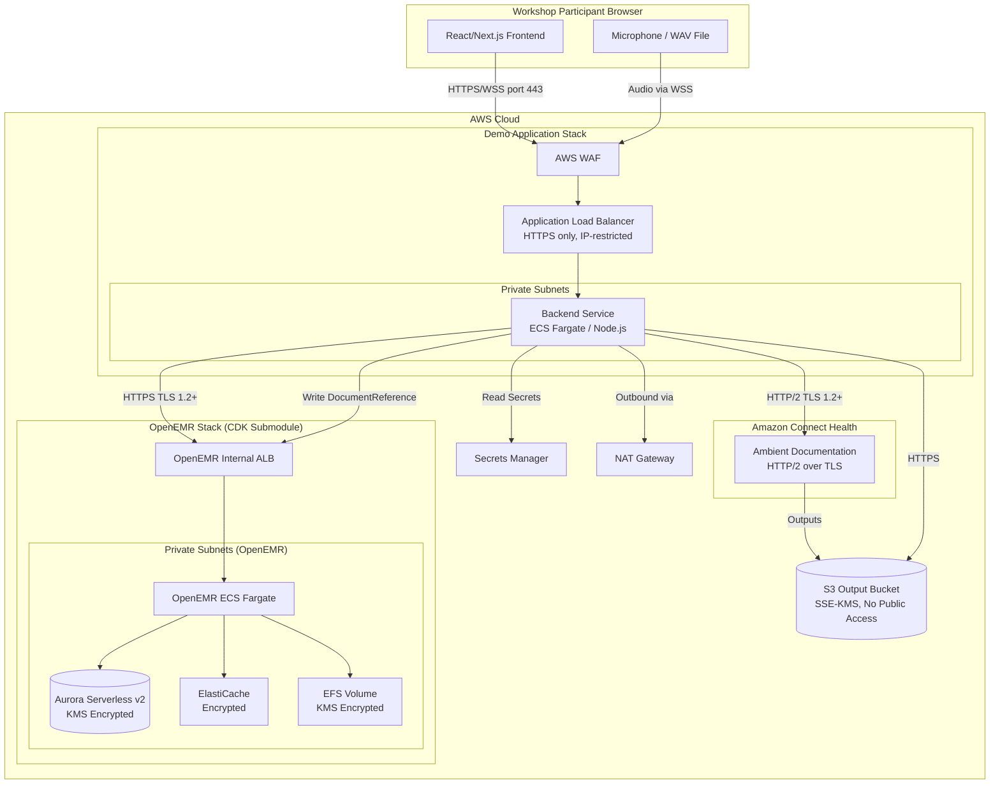
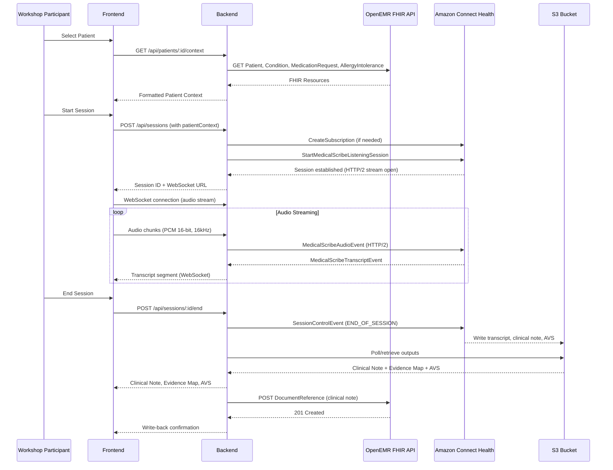

# Design Document

## Overview

This design describes the architecture for the Ambient Clinical Documentation Demo — a full-stack web application that demonstrates end-to-end ambient clinical documentation using Amazon Connect Health integrated with OpenEMR on AWS ECS. The system enables workshop participants to experience the complete workflow: retrieving patient data from an EHR, streaming a clinical conversation via HTTP/2 to Amazon Connect Health, viewing real-time transcription with speaker diarization, and reviewing structured clinical notes with evidence mapping that are written back to the patient record.

The application is composed of three deployment units:
1. **OpenEMR Infrastructure Stack** — CDK (Python) stack deploying OpenEMR on ECS Fargate with Aurora Serverless v2, ElastiCache, and EFS
2. **Demo Backend Service** — Node.js service handling HTTP/2 streaming to Amazon Connect Health, FHIR API interactions, and S3 output retrieval
3. **Demo Frontend** — React/Next.js web application providing the clinician-facing UI

Key design decisions:
- **Backend handles HTTP/2 streaming**: Browser clients cannot directly establish HTTP/2 connections to AWS services with SigV4 signing. The backend proxies audio from the browser (via WebSocket) to Amazon Connect Health (via HTTP/2).
- **SOAP template**: The demo uses the managed `PHYSICAL_SOAP` template for clinical note generation, producing Subjective/Objective/Assessment/Plan sections.
- **Pre-recorded WAV support**: For repeatable demos, the backend can stream audio from pre-recorded WAV files instead of live microphone input.
- **Git submodule for OpenEMR**: The openemr-on-ecs CDK stack is referenced as a Git submodule pinned to a specific release tag.

## Architecture

### System Architecture Diagram



### Data Flow Sequence



### Deployment Architecture

The demo deploys as two CDK stacks:

1. **OpenEMR Stack** (Python CDK, Git submodule) — Deploys the EHR infrastructure
2. **Demo App Stack** (TypeScript CDK) — Deploys the demo backend on ECS Fargate behind an ALB with HTTPS

The frontend is bundled with the backend as a Next.js application (server-side rendering + API routes), deployed as a single container.

## Security Architecture

### Network Security
- **No open inbound rules**: All security groups restrict inbound traffic to specific CIDR ranges — no 0.0.0.0/0 or ::/0 rules on any port
- **ALB ingress**: The Demo Application ALB accepts HTTPS (port 443) only from a configurable IP CIDR range specified as a CDK context parameter at deployment time (e.g., workshop participant's IP)
- **Private subnets**: ECS Fargate tasks, Aurora Serverless v2, ElastiCache, and EFS are deployed in private subnets with no direct internet access
- **NAT Gateways**: Outbound internet access for private subnet resources (pulling container images, calling AWS APIs) routes through NAT Gateways only
- **Internal ALB for OpenEMR**: The OpenEMR ALB is internal (not internet-facing), accessible only from the Demo Application's security group

### Encryption
- **In transit**: All communication uses TLS 1.2 or higher:
  - Browser → Demo App ALB (HTTPS)
  - Demo App → OpenEMR FHIR API (HTTPS)
  - Demo App → Amazon Connect Health (HTTP/2 over TLS)
  - Demo App → S3 (HTTPS)
- **At rest**:
  - S3 output bucket: SSE-KMS encryption with a dedicated KMS key
  - Aurora Serverless v2: KMS encryption at rest
  - EFS: KMS encryption at rest
  - ElastiCache: encryption at rest and in transit enabled

### Secrets Management
- All credentials stored in AWS Secrets Manager:
  - Database credentials (auto-rotated)
  - FHIR API OAuth2 client ID and secret
  - OpenEMR admin credentials
- ECS tasks reference secrets by ARN via `secrets` property in task definition — never passed as plain-text environment variables
- No secrets committed to source code or stored in CDK context

### S3 Bucket Security
- Block all public access (BlockPublicAcls, BlockPublicPolicy, IgnorePublicAcls, RestrictPublicBuckets)
- Bucket policy enforces `aws:SecureTransport` condition (SSL-only access)
- Server-side encryption with KMS (SSE-KMS)
- Versioning enabled for audit trail
- Access limited to the Demo Application's IAM role only

### IAM Least Privilege
- ECS task role has only the permissions needed:
  - `connecthealth:StartMedicalScribeListeningSession`, `connecthealth:GetMedicalScribeListeningSession`, `connecthealth:CreateDomain`, `connecthealth:CreateSubscription`, `connecthealth:GetDomain`, `connecthealth:ListDomains`
  - `s3:GetObject`, `s3:ListBucket` on the output bucket only
  - `secretsmanager:GetSecretValue` on specific secret ARNs only
- No wildcard (`*`) resource permissions

### Compliance Validation
- **cdk-nag**: Both CDK stacks include cdk-nag with the HIPAA Security rule pack (`HIPAASecurityChecks`)
- Deployment fails if any HIPAA-related findings are unresolved
- Suppressions require documented justification in code comments
- The OpenEMR submodule already includes cdk-nag checks (inherited from upstream)

### HIPAA Considerations for Workshop
- This demo uses **synthetic patient data only** (Synthea-generated)
- A Business Associate Agreement (BAA) with AWS is required for production use with real PHI
- The workshop guide documents these constraints and lists all security controls implemented
- The architecture is designed to be BAA-eligible when deployed with a signed BAA

## Components and Interfaces

### 1. Infrastructure Layer

#### OpenEMR CDK Stack (Git Submodule)
- **Technology**: Python CDK (from `host-openemr-on-aws-fargate` repository)
- **Resources**: ECS Fargate cluster, Aurora Serverless v2 (MySQL), ElastiCache (Redis), EFS, ALB, VPC
- **Outputs**: FHIR API base URL, OpenEMR web console URL, credentials secret ARN
- **Region validation**: Stack includes a region check that fails deployment outside us-east-1/us-west-2

#### Demo App CDK Stack
- **Technology**: TypeScript CDK
- **Resources**: ECS Fargate service (Next.js app), ALB with HTTPS (ACM certificate), S3 bucket for ambient outputs, IAM roles for Connect Health and S3 access
- **Security**: cdk-nag with HIPAA Security rule pack enabled; deployment fails on unresolved findings
- **Configuration**: Reads OpenEMR stack outputs via CloudFormation cross-stack references or SSM parameters

### 2. Backend Service

#### Technology Stack
- **Runtime**: Node.js 20 LTS
- **Framework**: Next.js 14 (App Router) with API routes
- **AWS SDK**: `@aws-sdk/client-connecthealth` for Connect Health API, `@aws-sdk/client-s3` for output retrieval
- **HTTP/2**: Node.js native `http2` module for streaming to Amazon Connect Health
- **WebSocket**: `ws` library for browser-to-backend audio streaming

#### API Endpoints

| Endpoint | Method | Description |
|----------|--------|-------------|
| `/api/patients` | GET | List patients from OpenEMR FHIR API |
| `/api/patients/:id/context` | GET | Retrieve and format patient context (≤10KB) |
| `/api/sessions` | POST | Create ambient session (domain, subscription, session) |
| `/api/sessions/:id/end` | POST | End ambient session |
| `/api/sessions/:id/outputs` | GET | Retrieve clinical note, evidence map, AVS from S3 |
| `/api/sessions/:id/writeback` | POST | Write clinical note back to OpenEMR |
| `/ws/audio/:sessionId` | WS | WebSocket endpoint for audio streaming |

#### Session Manager Module
- Manages the Amazon Connect Health session lifecycle
- Creates/reuses domains (matched by name) and subscriptions
- Handles HTTP/2 stream establishment and event publishing
- Sends configuration event with channel definitions, output S3 URI, and SOAP template
- Forwards audio chunks from WebSocket to HTTP/2 stream
- Receives transcript events and forwards to frontend via WebSocket
- Sends END_OF_SESSION control event on session end

#### FHIR Client Module
- Authenticates with OpenEMR OAuth2 (client credentials flow)
- Retrieves Patient, Condition, MedicationRequest, AllergyIntolerance resources
- Formats patient context with priority truncation (demographics → allergies → medications → conditions) to fit 10KB limit
- Creates DocumentReference resources for clinical note write-back

#### Output Retriever Module
- Polls S3 at the known output path: `s3://{bucket}/health-agent-listening-session/{domainId}/{subscriptionId}/{sessionId}/post-stream-action/`
- Retrieves clinical note (with evidence mapping) from `clinical-notes/` subfolder
- Retrieves transcript and after-visit summary
- Implements retry logic (3 retries at 10-second intervals, 60-second timeout)

### 3. Frontend Application

#### Technology Stack
- **Framework**: Next.js 14 (React 18)
- **Styling**: Tailwind CSS
- **State Management**: React Context + useReducer for session state
- **Audio**: Web Audio API for microphone capture, AudioContext for PCM encoding

#### UI Components

| Component | Responsibility |
|-----------|---------------|
| `PatientSelector` | Search and select patients from OpenEMR |
| `PatientContextPanel` | Display formatted patient context before session start |
| `SessionControls` | Start/end session, audio source selection (mic/file), lifecycle status display |
| `AudioIndicator` | Visual feedback for active audio capture/streaming |
| `TranscriptView` | Real-time transcript with speaker labels, auto-scroll, color-coded segments |
| `ClinicalNotePanel` | SOAP-formatted clinical note display with clickable evidence links |
| `EvidenceHighlighter` | Highlights transcript segments when note statements are selected |
| `AfterVisitSummaryPanel` | Patient-friendly summary in separate tab |
| `SessionLifecycleIndicator` | Shows current stage (domain setup → subscription → session → active → ended) |
| `ErrorBoundary` | Error display with corrective action suggestions |

#### Audio Pipeline
1. **Microphone mode**: `navigator.mediaDevices.getUserMedia()` → AudioWorklet (PCM 16-bit, 16kHz) → WebSocket
2. **WAV file mode**: FileReader → decode WAV header → stream PCM data at real-time rate → WebSocket
3. **Channel mapping**: Single-channel audio from browser; the backend maps to channel 0 (CLINICIAN) by default. For two-speaker demos with pre-recorded stereo WAV files, channels are split and mapped to channel 0 (CLINICIAN) and channel 1 (PATIENT).

### 4. Data Loading Utility

#### Synthea Patient Generator
- **Script**: `scripts/load-synthea-data.ts`
- **Input**: Synthea-generated FHIR R4 Bundles (100 patients)
- **Process**: Iterates bundles, POSTs each to OpenEMR FHIR API
- **Error handling**: Logs rejections with filename, continues processing remaining records
- **Output**: Summary of successful/failed loads

#### Compatibility Verification Script
- **Script**: `scripts/verify-compatibility.ts`
- **Process**: Runs `cdk synth` on the OpenEMR submodule, checks for expected output keys
- **Validation**: Confirms FHIR API URL, web console URL, and credentials secret ARN outputs exist

## Data Models

### Patient Context (formatted for encounterContext.unstructuredContext)

```typescript
interface PatientContext {
  demographics: {
    name: string;
    age: number;
    sex: string;
    dateOfBirth: string;
  };
  allergies: FHIRAllergyIntolerance[];
  medications: FHIRMedicationRequest[];
  conditions: FHIRCondition[];
}

// Formatted as plain text, max 10KB, with priority truncation
function formatPatientContext(context: PatientContext): string;
```

### Session State

```typescript
interface AmbientSession {
  sessionId: string;
  domainId: string;
  subscriptionId: string;
  status: 'creating_domain' | 'creating_subscription' | 'creating_session' | 'active' | 'ending' | 'ended' | 'error';
  patientId: string;
  patientContext: string;
  outputS3Uri: string;
  startedAt: Date;
  endedAt?: Date;
  error?: SessionError;
}

interface SessionError {
  stage: 'domain' | 'subscription' | 'session' | 'streaming' | 'output_retrieval';
  message: string;
  suggestedAction: string;
}
```

### Transcript Segment

```typescript
interface TranscriptSegment {
  id: string;
  content: string;
  speaker: 'CLINICIAN' | 'PATIENT' | 'UNKNOWN';
  channelId: number;
  startTime: number;
  endTime: number;
  isPartial: boolean;
}
```

### Clinical Note Output

```typescript
interface ClinicalNote {
  sections: SOAPSection[];
  evidenceMap: EvidenceMapping[];
}

interface SOAPSection {
  heading: 'Subjective' | 'Objective' | 'Assessment' | 'Plan';
  content: string;
}

interface EvidenceMapping {
  noteStatementId: string;
  noteStatement: string;
  sourceType: 'transcript' | 'patient_context';
  transcriptReference?: {
    startTime: number;
    endTime: number;
    content: string;
  };
}
```

### FHIR DocumentReference (Write-back)

```typescript
interface DocumentReferenceCreate {
  resourceType: 'DocumentReference';
  status: 'current';
  type: {
    coding: [{
      system: 'http://loinc.org';
      code: '11506-3';
      display: 'Progress note';
    }];
  };
  subject: { reference: string }; // Patient/{id}
  date: string; // ISO 8601
  description: string; // "Ambient Clinical Note - {date}"
  content: [{
    attachment: {
      contentType: 'text/plain';
      data: string; // Base64 encoded clinical note
    };
  }];
}
```

### Configuration

```typescript
interface AppConfig {
  aws: {
    region: 'us-east-1' | 'us-west-2';
    s3OutputBucket: string;
  };
  openemr: {
    fhirBaseUrl: string;
    clientId: string;
    clientSecret: string;
  };
  connectHealth: {
    domainName: string;
  };
  audio: {
    sampleRate: number; // minimum 16000
    bitDepth: 16;
    encoding: 'pcm';
  };
}
```

## Correctness Properties

*A property is a characteristic or behavior that should hold true across all valid executions of a system — essentially, a formal statement about what the system should do. Properties serve as the bridge between human-readable specifications and machine-verifiable correctness guarantees.*

### Property 1: Patient context priority truncation

*For any* patient data set (demographics, allergies, medications, conditions) of any size, formatting the patient context SHALL produce output that is at most 10KB, always includes demographics, and includes subsequent categories (allergies, medications, conditions) only if the higher-priority categories are fully included first.

**Validates: Requirements 3.2**

### Property 2: Partial FHIR failure handling

*For any* combination of FHIR resource type responses where at least one type succeeds and one or more types fail, the patient context display SHALL include all data from successful resource types and the warning message SHALL list exactly the resource types that failed.

**Validates: Requirements 3.5**

### Property 3: Data loading error continuity

*For any* batch of patient bundles where some are rejected by the FHIR API, the loading script SHALL log each rejection with its bundle filename and continue processing all remaining bundles in the batch.

**Validates: Requirements 2.4**

### Property 4: Data loading summary accuracy

*For any* batch of N patient bundle load attempts resulting in K failures, the summary output SHALL report exactly (N - K) successful loads and exactly K failed loads.

**Validates: Requirements 2.6**

### Property 5: Session lifecycle error stage identification

*For any* failure occurring during domain creation, subscription creation, or session creation, the error display SHALL correctly identify the failure stage and include a non-empty corrective action suggestion.

**Validates: Requirements 4.5**

### Property 6: Session lifecycle state machine

*For any* valid sequence of session lifecycle events (domain setup → subscription setup → session creation → active → ended), the displayed lifecycle stage SHALL match the current state and transitions SHALL only move forward through the defined stages.

**Validates: Requirements 4.6**

### Property 7: WAV file parsing and streaming

*For any* valid WAV file with PCM 16-bit encoding at 16000 Hz sample rate, the parser SHALL correctly extract the audio data payload and the streamer SHALL emit audio chunks that, when concatenated, equal the original PCM data.

**Validates: Requirements 5.4**

### Property 8: Transcript speaker attribution and visual distinction

*For any* transcript segment with a speaker role (CLINICIAN or PATIENT), the rendered output SHALL include the correct speaker label AND apply a visually distinct style (CSS class or attribute) that differs between CLINICIAN and PATIENT segments.

**Validates: Requirements 6.2, 6.3**

### Property 9: Clinical note and evidence map rendering completeness

*For any* clinical note containing SOAP sections and evidence mappings, the rendered output SHALL include all four section headings (Subjective, Objective, Assessment, Plan) with their content, and SHALL render every evidence mapping entry with its source reference.

**Validates: Requirements 7.2, 7.3**

### Property 10: After-visit summary verbatim rendering

*For any* after-visit summary content string received from the Ambient Service, the rendered output SHALL contain the exact content without modification, addition, or removal of text.

**Validates: Requirements 8.3**

### Property 11: Missing environment variable reporting

*For any* subset of required environment variables where at least one is missing, the application SHALL exit with non-zero status and the error message SHALL list every missing variable by name.

**Validates: Requirements 10.4**

### Property 12: Region validation

*For any* AWS region string, the validation function SHALL accept only "us-east-1" and "us-west-2" and reject all other values, blocking session creation for rejected values.

**Validates: Requirements 11.2, 11.3**

### Property 13: DocumentReference structure completeness

*For any* clinical note content and associated patient reference, the generated FHIR DocumentReference resource SHALL contain: a text attachment with the note content, a subject reference to the patient, the session date, and the document type coding.

**Validates: Requirements 14.2**

### Property 14: Security group ingress validation

*For any* security group created by the CDK stacks, no ingress rule SHALL specify a source CIDR of 0.0.0.0/0 or ::/0 on any port. The ALB security group SHALL only allow inbound traffic on port 443 from the configured IP CIDR range.

**Validates: Requirements 13.1, 13.2**

## Error Handling

### Error Categories and Strategies

| Category | Scenario | Strategy |
|----------|----------|----------|
| **Infrastructure** | CDK deployment failure | Output failure reason, CloudFormation rollback ensures no orphaned resources |
| **Infrastructure** | cdk-nag HIPAA finding | Deployment fails with finding details; must resolve or suppress with justification |
| **Configuration** | Missing env vars, invalid region | Fail fast on startup with descriptive error listing all issues |
| **FHIR Connectivity** | OpenEMR unreachable, timeout | 10-second timeout, display connection error, block session start |
| **FHIR Partial Failure** | Some resource types fail | Display available data, warn about missing types |
| **Session Lifecycle** | Domain/subscription/session creation failure | Display failure stage, suggest corrective actions (check permissions, region, subscription status) |
| **Audio Streaming** | HTTP/2 connection drop, 30s silence | Notify user, offer session restart |
| **Microphone** | Permission denied | Display instructions to grant access |
| **Output Retrieval** | S3 object not available | Retry 3 times at 10-second intervals (60s total), then show error with manual retry option |
| **Write-back** | FHIR write failure | Display error type and reason, offer up to 3 retry attempts |
| **Data Loading** | Individual bundle rejection | Log rejection with filename, continue processing remaining bundles |

### Error Response Format

```typescript
interface ErrorResponse {
  code: string;           // Machine-readable error code
  message: string;        // Human-readable description
  stage?: string;         // Lifecycle stage where error occurred
  suggestedAction?: string; // What the user should do
  retryable: boolean;     // Whether retry is available
  retryCount?: number;    // Current retry attempt (if retrying)
  maxRetries?: number;    // Maximum retry attempts allowed
}
```

### Retry Strategy

- **S3 output retrieval**: 3 retries, 10-second intervals, 60-second total timeout
- **FHIR write-back**: 3 retries, user-initiated (click retry button)
- **Session creation**: No automatic retry (user must re-initiate)
- **Audio stream reconnection**: User-initiated restart (new session)

## Testing Strategy

### Unit Tests

Unit tests cover pure logic and component rendering:

- **Patient context formatter**: Truncation logic, priority ordering, edge cases (empty data, exactly 10KB, single category exceeding 10KB)
- **Region validator**: Accept/reject logic for region strings
- **WAV parser**: Header parsing, PCM data extraction, invalid file handling
- **Transcript renderer**: Speaker labeling, styling, UNKNOWN fallback
- **Clinical note renderer**: SOAP section display, evidence map linking
- **DocumentReference builder**: FHIR resource structure, required fields
- **Configuration validator**: Missing env var detection, error message formatting
- **Session state machine**: Valid transitions, error state handling
- **Data loading summary**: Count accuracy across success/failure combinations

### Property-Based Tests

Property-based tests validate universal properties using [fast-check](https://github.com/dubzzz/fast-check) (JavaScript/TypeScript PBT library):

- **Minimum 100 iterations** per property test
- Each test references its design document property via tag comment
- Tag format: `// Feature: ambient-clinical-documentation-demo, Property {N}: {title}`

Properties tested:
1. Patient context truncation always produces ≤10KB output with correct priority
2. Partial FHIR failure shows correct data and warnings
3. Data loading continues after rejections and logs filenames
4. Data loading summary counts match actual results
5. Session error messages identify correct failure stage
6. Session state machine only transitions forward
7. WAV parsing round-trip preserves audio data
8. Transcript segments get correct speaker labels and distinct styles
9. Clinical note rendering includes all SOAP sections and evidence mappings
10. AVS rendering preserves content verbatim
11. Missing env var errors list all missing variables
12. Region validation accepts only us-east-1 and us-west-2
13. DocumentReference contains all required FHIR fields
14. Security group ingress rules never allow 0.0.0.0/0 or ::/0

### Integration Tests

Integration tests verify external service interactions:

- **FHIR API connectivity**: Metadata request returns CapabilityStatement
- **Patient data retrieval**: Demographics, conditions, medications, allergies returned
- **Synthea data loading**: Bundles load successfully into OpenEMR
- **Amazon Connect Health session**: Domain/subscription/session creation succeeds
- **Audio streaming**: HTTP/2 stream established and transcript events received
- **S3 output retrieval**: Clinical note, evidence map, and AVS retrieved from correct path
- **FHIR write-back**: DocumentReference created and visible in patient record
- **End-to-end flow**: Full workflow from patient selection through note write-back

### Smoke Tests

Smoke tests verify deployment and configuration:

- CDK stack deploys successfully and outputs expected keys
- cdk-nag HIPAA Security rule pack passes with no unresolved findings
- No security group has inbound rules from 0.0.0.0/0 or ::/0
- S3 bucket has public access blocked and encryption enabled
- Application starts and responds on HTTPS
- FHIR API endpoint is reachable from application
- Workshop guide file exists with required sections
- Git submodule is pinned to documented release tag
- Compatibility verification script passes

### Test Infrastructure

- **Framework**: Jest with `@testing-library/react` for component tests
- **PBT Library**: fast-check for property-based tests
- **Mocking**: MSW (Mock Service Worker) for FHIR API and S3 mocks in unit/property tests
- **Integration environment**: Deployed stacks in a test AWS account
- **CI/CD**: GitHub Actions running unit + property tests on every PR, integration tests on merge to main

